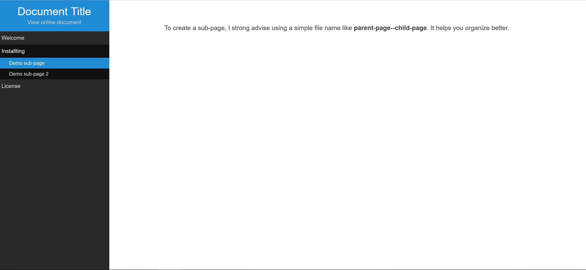

# Document Starter Template
A great starter HTML template (with Javascript + skeleton framework) to generate your document file quick and easy with modern style.

## Screenshots:

[View mobile screenshot](screenshots/mobile-screenshot.png)

## Installation

Just move a full package to where you want to display.

### To create a new content:

*Step 1:*
Adding to #menu at index.html (root) like
```
<li><a href="#installing">Installing</a></li>
```

*Step 2:*
Creating a new file *installing.html* in folder /includes/
Place your content.

### To create a sub page:

*Step 1:*
Adding to #menu at index.html (root) like

```
<li>
    <a href="#main">Main Item</a>
    <ul class="sub-menu">
        <li><a href="#main--item-1">Sub Item 1</a></li>
    </ul>
</li>
```

*Step 2:*
Creating a new file *main--item-1.html* in folder /includes/
Place your content.


### Extra
*editor.php* - To help you preparing content better. Just copy content in editor, then choose *'view code'* to copy it to your /includes/ files.

##### License
Author: http://khoipro.com
Framework extend: http://purecss.io
Grid and Typography: http://getskeleton.com
Editor: http://tinymce.com
